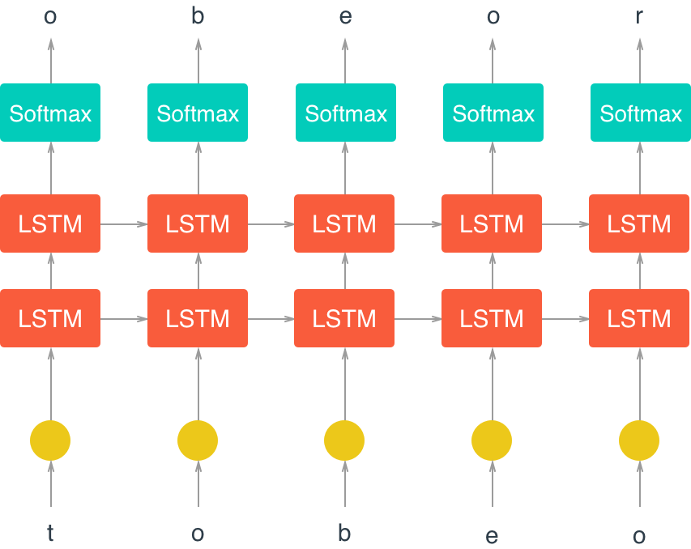

# Talking-points-global-hackathon

- [Problem Description](#problem-description)
- [Data Source & Description](#data-source---description)
    + [Context](#context)
    + [Content](#content)
- [Deep Learning Algorithm for Talking Points](#deep-learning-algorithm-for-talking-points)
  * [Implement pre-processing functions](#implement-pre-processing-functions)
    + [Word-Embedding](#word-embedding)
    + [Word2vec Model](#word2vec-model)
- [Build the Neural Network](#build-the-neural-network)
  * [The Neural Network](#the-neural-network)
  * [Model Training ](#time-to-train)
  * [Hyper-parameter Tuning](#hyper-parameter-tuning)
- [Generated Talking Points](#Generated-Talking-Points)
- [Sentiment Analysis on Stock Data](#Sentiment-Analysis-on-Stock-Data)
- [Converting the final result into CSV file](#Converting-the-final-result-into-CSV-file)
- [Future Improvements](#Future-Improvements)


# Problem Description

# Data Source & Description

## Description:

We have gathered the data for training our model from Kaggle's dataset [US Financial News Articles](https://www.kaggle.com/jeet2016/us-financial-news-articles?)


### Context

The data set is rich with metadata, containing the source of the article, the time it was published to the author details and Images related to every article. 
Excellent for text analysis and combined with any other related entity dataset, it could give some astounding results.

### Content

The main Zip file contains 5 other folders , each for every month in 2018 from January to May.

JSON files have articles based on the following criteria:

News publishers: Bloomberg.com, CNBC.com, reuters.com, wsj.com, fortune.com
Language: Only English
Country: United States
News Category: Financial news only

The source for the articles (Archive source: httsps://Webhose.io/archive )

# Deep Learning Algorithm for Talking Points

The deep-learning algorithm is implemented in Python using [Pytorch](https://pytorch.org) library.

## Implement pre-processing functions

### Word-Embedding

Word embedding is a collective term for models that learn to map a set of words or phrases in a vocabulary to vectors of numerical values. These vectors are called embeddings. We can use neural network to learn word-embeddings.<br><br>

For example, lets say the word "stock" is encoded as the integer "958", then to get hidden-layer values for "stock", we just take 958th row of the embeddng weight matrix. This process is known as **Embedding Look-up.** 

</img>


### Word2vec Model

The Word2Vec algorithm finds much more efficient representations by finding vectors that represent the words. These vectors also contain semantic information about the words. For example consider the below excerts from BBC on impact Corona pandemic on US economy-<br>

> "Investors fear the spread of the **corona pandemic** will **destroy economic growth.**"<br>
> "More than 30m people have been **unemployeed** due to the **corona pandemic.** "<br>
> "**Oil prices have crashed** since demand for oil has dried up as **corona pandemic lockdown** across the world have kept people inside."<br>

Words that show up in similar contexts, such as "destroy economic growth", "unemployeed", and "oil prices have crashed" will have vectors near each other. Different words will be further away from one another, and relationships can be represented by distance in vector space. An example is shown below - <br>


</img>


# Build the Neural Network
## The Neural Network
We have implemented an RNN using PyTorch's [Module class](http://pytorch.org/docs/master/nn.html#torch.nn.Module) along with LSTM. The following functions completed our RNN model -<br>
 - `__init__` - The initialize function. 
 - `init_hidden` - The initialization function for an LSTM hidden state
 - `forward` - Forward propagation function.
 

**The output of this model is the *last* batch of word scores** after a complete sequence has been processed. That is, for each input sequence of words, we only want to output the word scores for a single, most likely, next word.<br><br>

Our neural network architerure w.r.t charecter-wise RNN is better depicted below - <br>

</img>
<br>


## Time to train

The train function gives us the ability to set the number of epochs, the learning rate, and other parameters.

Below we're using an *Adam optimizer* and *cross entropy loss* since we are looking at word class scores as output. We calculate the loss and perform backpropagation, as usual!

A couple of details about training: 
>* Within the batch loop, we detach the hidden state from its history; this time setting it equal to a new *tuple* variable because an LSTM has a hidden state that is a tuple of the hidden and cell states.
>* We use [`clip_grad_norm_`](https://pytorch.org/docs/stable/_modules/torch/nn/utils/clip_grad.html) to help prevent exploding gradients.


## Hyper-parameter Tuning

Following are the list of hyper-parameter values that we have used while training our model - <br>

| S.No. | Hyper-parameter        | Description                                                             | Value               |
|-------|------------------------|-------------------------------------------------------------------------|---------------------|
| 1.    | `sequence_length`      | length of a sequence                                                    | 10                  |
| 2.    | `batch_size`           | batch size                                                              | 128                 |
| 3.    | `num_epochs`           | number of epochs to train for                                           | 10                  |
| 4.    | `learning_rate`        | learning rate for an Adam optimizer                                     | 0.001               |
| 5.    | `vocab_size`           | number of uniqe tokens in our vocabulary                                | `len(vocal_to_int)` |
| 6.    | `output_size`          | desired size of the output                                              | `vocab_size`        |
| 7.    | `embedding_dim`        | embedding dimension; smaller than the vocab_size                        | 200                 |
| 8.    | `hidden_dim`           | hidden dimension of our RNN                                             | 250                 |
| 9.    | `n_layers`             | number of layers/cells in your RNN                                      | 2                   |
| 10.   | `show_every_n_batches` | number of batches at which the <br>neural network should print progress | 500                 |


# Generated Talking Points

We need to feed the model a *prime word* on the basis of which the model then generates the talking points. For example - <br>

Upon feeding the model the word "corona", the model generates the following talking points - 

```
corona. m. est
** the dollar slipped 0. 2 percent to 3. 5 percent.
in the past decade, the dow jones industrial average was up 0. 2 percent at $1, 326. 00 a barrel.
a weaker u. s. dollar slipped from a basket of major currencies in 2018.
the dow jones industrial average index was down 0. 3 percent to the lowest level in the past five months, ” the official said.
the ministry is not immediately available to comment

```

# Sentiment Analysis on Stock Data

Sentiment analysis on stock data can be added to one's advantage. If you look for an extreme example of how social media influences stock market, take a look at Kylie Jenners’ tweet about Snapchat. <br>

</img>

Shortly after the message was posted online, the price of Snap, Snapchat parent company, fell by 8.5 percent.


# Converting the final result into CSV file

After generating the talking points and predicting the sentiment, we save the entire result to a csv file so that it can be called from an API.


# Future Improvements 

We need to address the following points for better model accuracy - 

1. Better data-set related to stock news
2. Traning on large volumes of data.
3. Training for larger epochs
4. Exploring BiLSTM
